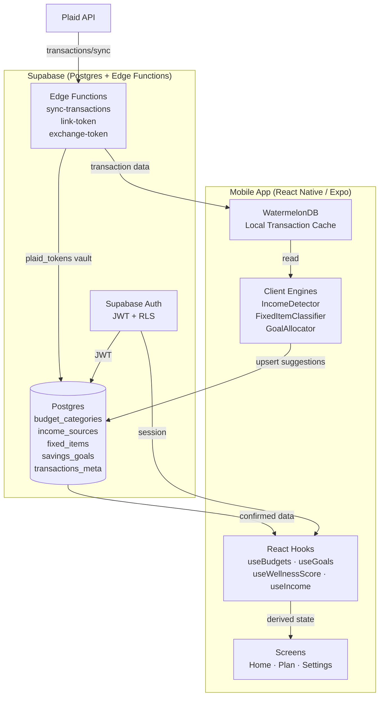
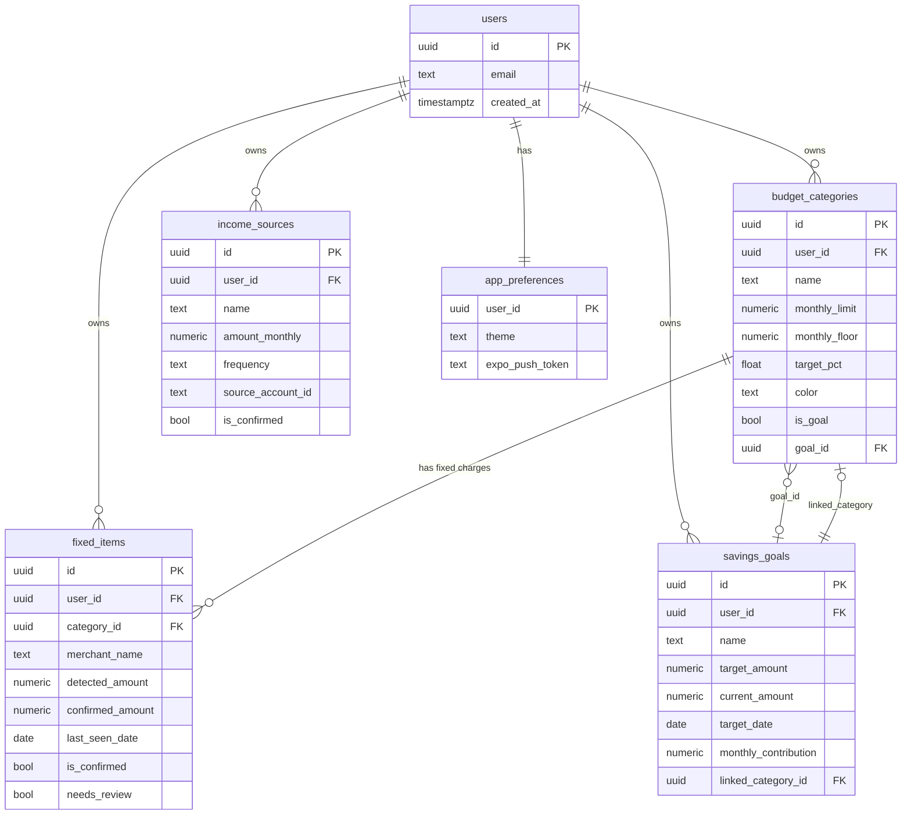
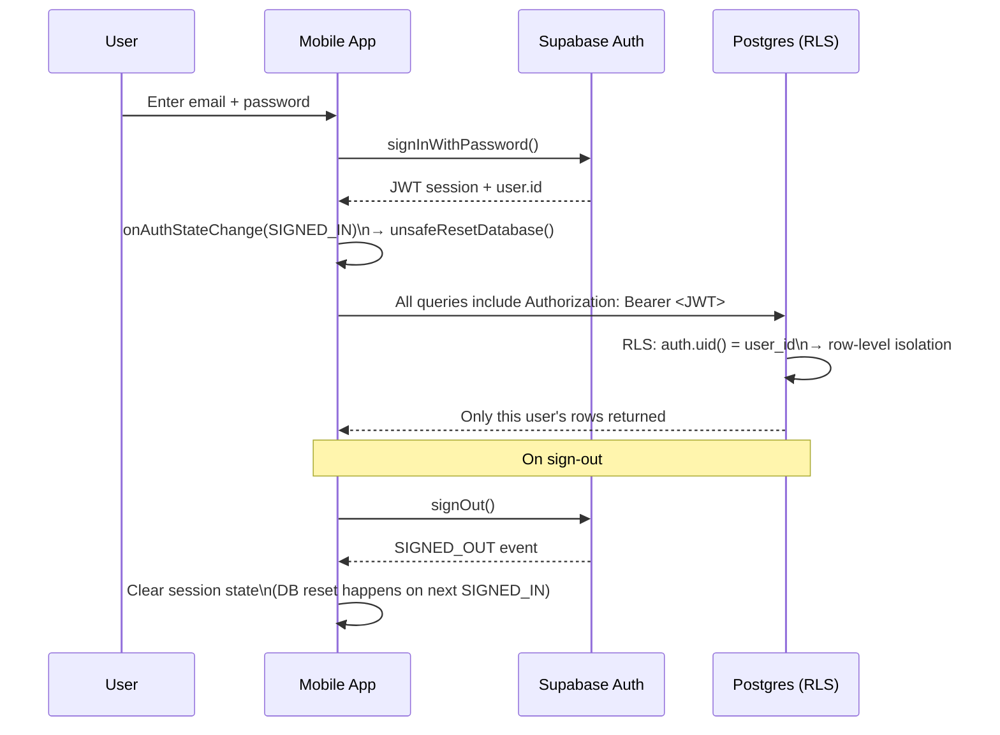
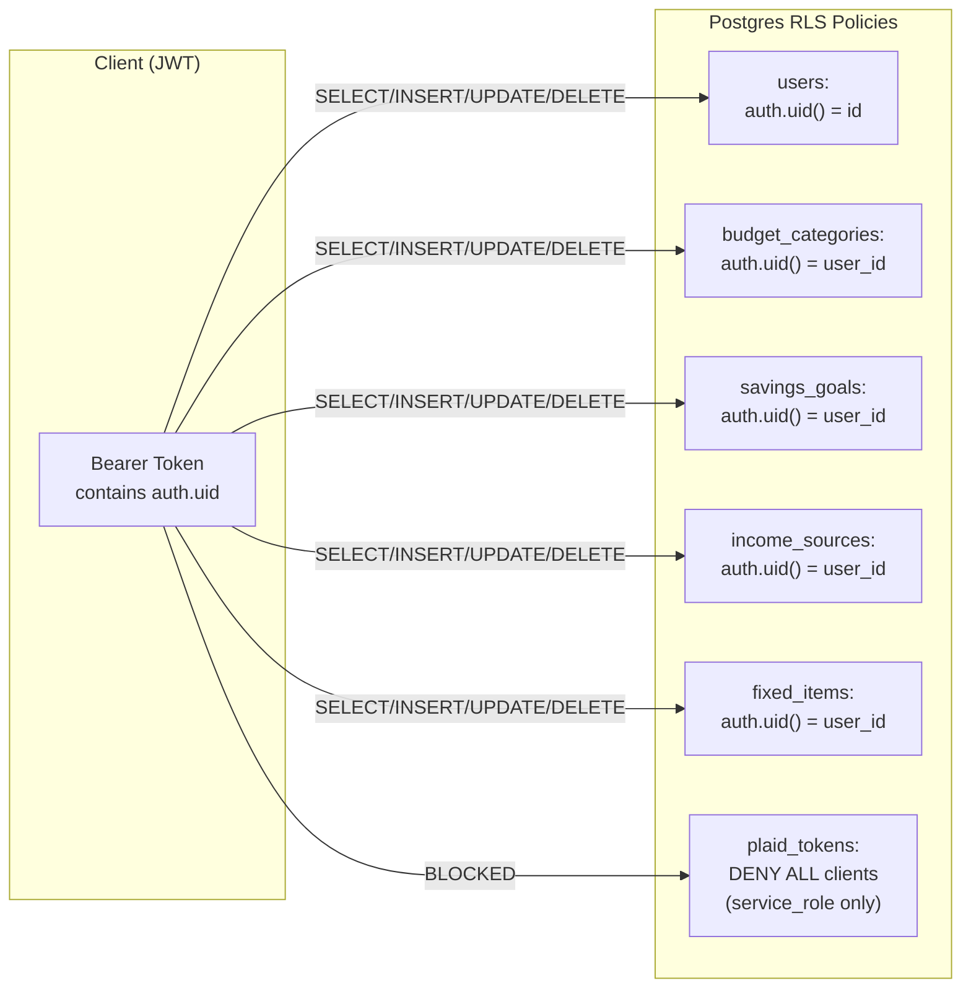
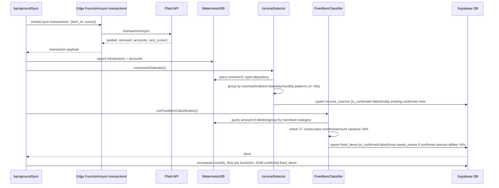
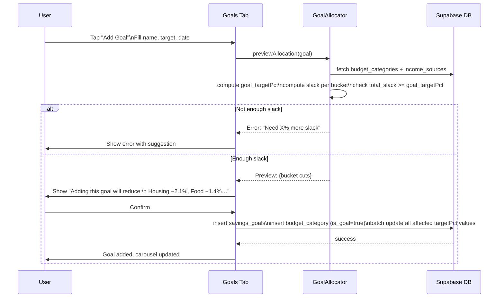
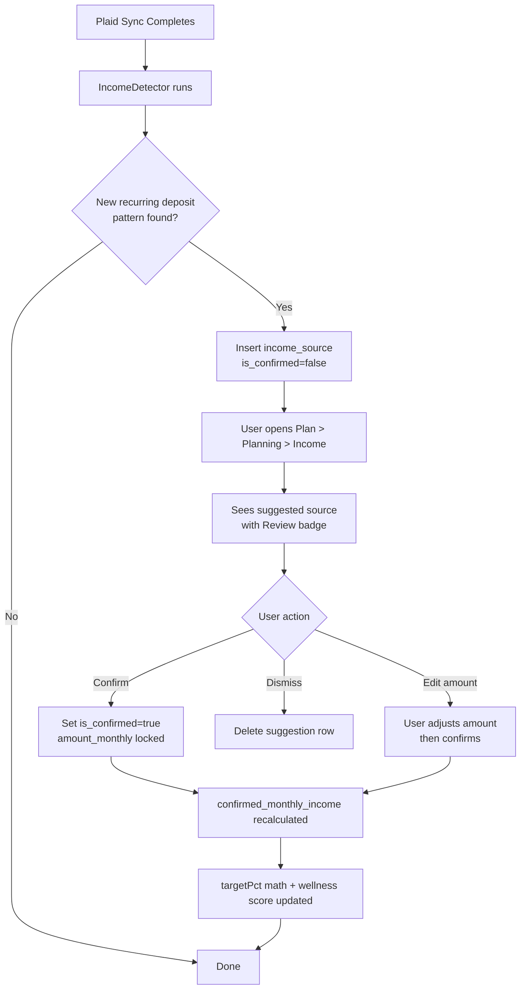
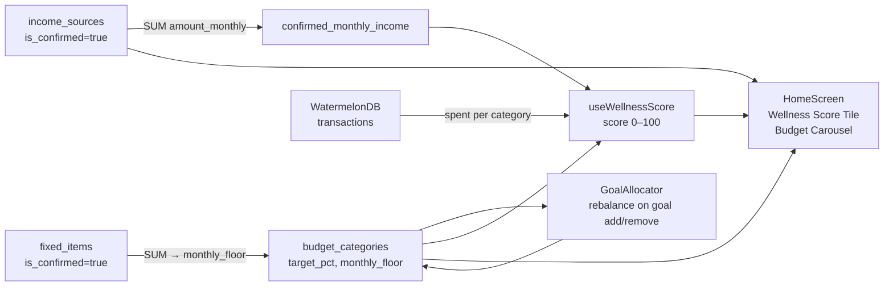

# Smart Budget Engine — Design Spec

> **For agentic workers:** Use `superpowers:executing-plans` or `superpowers:subagent-driven-development` to implement this spec task-by-task.

**Goal:** Replace static manual budget numbers with a data-driven engine that auto-detects income, classifies fixed vs. variable charges, and dynamically rebalances bucket allocations when savings goals are added — all while preserving confirmed floors and keeping the wellness score as the single source of financial health.

**Architecture:** Three cooperating engines (Income, Fixed-Item Classifier, Goal Allocator) share a common Supabase data layer and are triggered by the existing Plaid sync pipeline. The mobile app reads derived values from Supabase and presents them through a cohesive, emoji-free UI.

**Tech Stack:** React Native (Expo), WatermelonDB (local transaction cache), Supabase (Postgres + RLS + Edge Functions), Plaid (transaction source), TypeScript.

---

## Table of Contents

1. [Data Model](#1-data-model)
2. [Income Engine](#2-income-engine)
3. [Fixed-Item Classifier](#3-fixed-item-classifier)
4. [Goal-Budget Allocation Engine](#4-goal-budget-allocation-engine)
5. [Wellness Score Integration](#5-wellness-score-integration)
6. [UI & Navigation](#6-ui--navigation)
7. [Diagrams](#7-diagrams)
   - [System Architecture](#71-system-architecture)
   - [Data Model (ERD)](#72-data-model-erd)
   - [Authentication Flow](#73-authentication-flow)
   - [Authorization (RLS)](#74-authorization-rls)
   - [Plaid Sync & Detection Pipeline](#75-plaid-sync--detection-pipeline)
   - [Goal Creation Sequence](#76-goal-creation-sequence)
   - [Income Confirmation Flow](#77-income-confirmation-flow)
   - [Data Flow: Income → Wellness Score](#78-data-flow-income--wellness-score)
8. [Backlog](#8-backlog)

---

## 1. Data Model

### New Tables

#### `income_sources`
Stores confirmed and suggested recurring income streams per user.

| Column | Type | Notes |
|---|---|---|
| `id` | uuid PK | gen_random_uuid() |
| `user_id` | uuid FK → users | RLS enforced |
| `name` | text | e.g. "Employer Direct Deposit" |
| `amount_monthly` | numeric(10,2) | Normalized to monthly regardless of frequency |
| `frequency` | text | `'biweekly' \| 'monthly' \| 'manual'` |
| `source_account_id` | text nullable | Plaid account_id, null for manual |
| `is_confirmed` | bool default false | Only confirmed sources feed monthly_income |
| `created_at` | timestamptz | default now() |

#### `fixed_items`
Individual recurring fixed charges auto-detected or manually added, linked to a budget bucket.

| Column | Type | Notes |
|---|---|---|
| `id` | uuid PK | gen_random_uuid() |
| `user_id` | uuid FK → users | RLS enforced |
| `category_id` | uuid FK → budget_categories | Which bucket this charge belongs to |
| `merchant_name` | text | Normalized merchant name from Plaid |
| `detected_amount` | numeric(10,2) | Latest auto-detected recurring amount |
| `confirmed_amount` | numeric(10,2) nullable | User override; null = use detected_amount |
| `last_seen_date` | date | Date of most recent matching transaction |
| `is_confirmed` | bool default false | **Only confirmed items count toward monthly_floor** |
| `needs_review` | bool default false | Set true when new charge differs from confirmed by >5% |

### Changes to Existing Tables

#### `budget_categories` additions

| Column | Type | Notes |
|---|---|---|
| `monthly_floor` | numeric(10,2) default 0 | Derived: SUM of confirmed fixed_items for this category. Recomputed on any fixed_item confirm/update. |
| `is_goal` | bool default false | True for goal-generated buckets |
| `goal_id` | uuid nullable FK → savings_goals | Links back to the goal that created this bucket |

#### `savings_goals` additions

| Column | Type | Notes |
|---|---|---|
| `linked_category_id` | uuid nullable FK → budget_categories | The budget bucket created for this goal |
| `monthly_contribution` | numeric(10,2) | Computed: (target_amount - current_amount) / months_remaining |

### Invariant

```
SELECT SUM(target_pct) FROM budget_categories WHERE user_id = $1
```
Must always equal **100** after any goal create/delete or rebalance operation. Enforced in application logic before any Supabase write.

---

## 2. Income Engine

### Detection Algorithm

Runs client-side after every Plaid sync completes, reading from WatermelonDB.

```
1. Query transactions WHERE amount < 0 AND account.type = 'depository'
   (Plaid convention: negative = deposit/credit into account)

2. Group by normalized merchant_name (lowercase, strip punctuation)

3. For each group, sort occurrences by date ascending.
   Test biweekly pattern:  consecutive gaps of 12–18 days, 3+ occurrences
   Test monthly pattern:   consecutive gaps of 25–35 days, 3+ occurrences

4. If pattern detected:
     frequency = 'biweekly' | 'monthly'
     amount_monthly = avg(amount) × (26/12 if biweekly, else 1)
     Insert income_sources row with is_confirmed = false IF no existing row
     for same (user_id, source_account_id, merchant_name)

5. Existing confirmed sources are NEVER auto-modified.
   Only unconfirmed suggestions are created/updated.
```

### Monthly Income Figure

```
confirmed_monthly_income = SUM(amount_monthly)
  FROM income_sources
  WHERE user_id = $1 AND is_confirmed = true
```

This single value is the denominator for all `targetPct` math and the wellness score.

### Edge Cases

- **No confirmed income yet:** wellness score returns 0, goal creation is blocked with an "Add your income first" prompt.
- **Income changes month-to-month:** system surfaces new unconfirmed suggestion when a previously-confirmed source's amount drifts >10% for 2+ consecutive occurrences.
- **Multiple Plaid accounts:** income is detected per-account, deduplicated by merchant+account pair.

---

## 3. Fixed-Item Classifier

### Detection Algorithm

Runs client-side after every Plaid sync, reading from WatermelonDB.

```
1. Query transactions WHERE amount > 0 (debits)
   Group by normalized merchantName + categoryL1

2. For each group:
   a. Sort by date. Group into calendar months.
   b. Check if merchant appears in 2+ consecutive months
      with amount variance ≤ 5%.
   c. If yes → candidate fixed item for categoryL1 bucket

3. Look up or create fixed_items row:
   - If no existing row: insert with is_confirmed=false, detected_amount=avg(amounts)
   - If existing confirmed row:
       new_amount = latest charge amount
       if |new_amount - confirmed_amount| / confirmed_amount > 0.05:
         set needs_review = true, update detected_amount = new_amount
       else:
         update last_seen_date only

4. monthly_floor for a bucket = SUM(confirmed_amount ?? detected_amount)
   WHERE category_id = $1 AND is_confirmed = true
   (Unconfirmed items have ZERO effect on the floor)
```

### Floor Enforcement Rule

When rebalancing buckets (goal allocation or manual edit):

```
effective_floor_pct_i = (monthly_floor_i / confirmed_monthly_income) × 100
minimum_targetPct_i   = MAX(effective_floor_pct_i, 1.0)  // never below 1%
available_slack_i     = targetPct_i - minimum_targetPct_i
```

Only `available_slack_i` is eligible to be cut when a goal is added.

---

## 4. Goal-Budget Allocation Engine

### Adding a Goal

```
Input:  name, target_amount, current_amount, target_date
        confirmed_monthly_income (from income_sources)
        existing budget_categories with targetPct and monthly_floor

1. months_remaining = ceil((target_date - today) / 30)
   monthly_contribution = (target_amount - current_amount) / months_remaining
   goal_targetPct = (monthly_contribution / confirmed_monthly_income) × 100

2. For each non-goal bucket i:
     slack_i = targetPct_i - (monthly_floor_i / confirmed_monthly_income × 100)
     slack_i = MAX(slack_i, 0)

   total_slack = SUM(slack_i)

3. If total_slack < goal_targetPct:
     REJECT with error: "Not enough flexible budget.
     You need {goal_targetPct - total_slack}% more slack.
     Confirm more fixed items or extend the goal timeline."

4. Distribute cut inversely weighted by targetPct:
     weight_i    = 1 / targetPct_i          (lower targetPct = higher weight = bigger cut)
     total_w     = SUM(weight_i)
     raw_cut_i   = (weight_i / total_w) × goal_targetPct

     // Enforce floor: cap cut at available slack
     cut_i       = MIN(raw_cut_i, slack_i)

     // If caps cause under-distribution, redistribute remainder
     // to uncapped buckets (iterative until converged or error)

5. new_targetPct_i = targetPct_i - cut_i   for all non-goal buckets

6. Create budget_category row:
     { name: goal.name, is_goal: true, goal_id: goal.id,
       target_pct: goal_targetPct, monthly_floor: 0,
       color: derived from goal progress }

7. Create savings_goals row with linked_category_id = new category id

8. Batch-upsert all modified targetPct values + new category to Supabase.
   Verify SUM = 100 before committing.
```

### Removing a Goal

```
1. Record removed_targetPct = goal_category.target_pct
2. Delete budget_category row (is_goal=true)
3. Redistribute removed_targetPct back to non-goal buckets,
   proportional to their current targetPct (higher priority = gets more back)
4. Verify SUM = 100. Batch-upsert.
```

### Goal Progress Tracking

- Each Plaid sync: detect transactions tagged `TRANSFER_OUT` or `SAVINGS` on accounts linked to the goal
- If no automatic signal: user manually updates `current_amount` (existing `updateGoalProgress`)
- Goal bucket's "spent" for wellness = monthly_contribution - actual_saved_this_month

---

## 5. Wellness Score Integration

The existing `useWellnessScore` hook is unchanged in interface. Changes are in the data it receives:

- Goal buckets contribute to the score like any other bucket (weighted by `targetPct`)
- A goal bucket's `spent` = how much was actually saved this period toward the goal
- Fixed floors mean a bucket can never have 0 budget — the wellness score won't penalize unavoidable fixed charges that fill the floor
- `monthly_income` passed to the hook = `confirmed_monthly_income` from `income_sources`

**Score formula reminder:**
```
cat_score_i = clamp(1 - max(0, ratio_i - 1), 0, 1)
  where ratio_i = spent_i / (monthly_income × targetPct_i / 100)

wellness_score = round(SUM(cat_score_i × targetPct_i) / SUM(targetPct_i) × 100)
```

---

## 6. UI & Navigation

### HomeScreen

- **Income tile** (new, sits above score tile): shows confirmed monthly income total. Tap → Plan > Planning > Income tab. Style: same dark card as score tile, smaller height, left-aligned label "MONTHLY INCOME", right-aligned total.
- **Budget carousel**: goal buckets appear as tiles with a progress bar (% of target funded) and "X months left" label. Regular bucket tiles unchanged.
- **Budget bar**: shows floor marker (thin white line across the allocation bar) indicating the fixed minimum. Variable headroom above the floor in the bucket's color at full opacity; floor portion in 40% opacity.

### PlanScreen — Planning Tab

Replace current accordion with a three-segment control at the top: **Buckets · Goals · Income**

#### Income Tab
- Header: "Monthly Income — $X,XXX" (large, confirmed total only)
- List of confirmed income sources: name left, amount + frequency badge right, swipe-left to delete
- Unconfirmed suggestions section (if any): labeled "Suggested — tap to review", each item shows a "Review" chip
- "Add Income Source" button at bottom → modal with name, amount, frequency fields
- No emojis. Use a colored left-border accent per source (green = confirmed, amber = unconfirmed)

#### Buckets Tab
- Each bucket row: name, allocation bar with floor marker, monthly allocation amount
- Expandable: tap to see fixed items list + "Review fixed charges" if `needs_review` items exist
- Fixed item rows: merchant name, detected amount, confirmed amount (editable inline), confirm/dismiss actions

#### Goals Tab
- Existing goals list
- "Add Goal" button: opens modal → triggers allocation engine preview before confirming ("Adding this goal will reduce: Housing −2.1%, Food −1.4%, …")

### Plan > Report Tab

Unchanged from current implementation.

---

## 7. Diagrams

### 7.1 System Architecture



### 7.2 Data Model (ERD)



### 7.3 Authentication Flow



### 7.4 Authorization (RLS)



### 7.5 Plaid Sync & Detection Pipeline



### 7.6 Goal Creation Sequence



### 7.7 Income Confirmation Flow



### 7.8 Data Flow: Income → Wellness Score



---

## 8. Backlog

Items approved but deferred to a future implementation cycle:

| # | Feature | Notes |
|---|---|---|
| B-1 | Swipe-left on Planning items → red reveal on right edge → confirm delete prompt | Replaces long-press delete. Red background slides in from right as user swipes. |
| B-2 | Swipe-left delete visual: animated red panel with trash icon appears on right side of item tile | Part of B-1 UX — distinct from the confirm prompt, this is the visual affordance while mid-swipe. |

---

## Implementation Order

Build in this sequence — each layer feeds the next:

1. **Supabase migrations** — new tables, new columns
2. **Income Engine** — detection + `useIncome` hook + Income tab UI
3. **Fixed-Item Classifier** — detection + Buckets tab UI with floor markers
4. **Goal Allocator** — rebalancing logic + Goals tab preview
5. **Wellness score wiring** — connect `confirmed_monthly_income` + goal buckets
6. **Home screen updates** — income tile, goal tiles in carousel, floor markers
